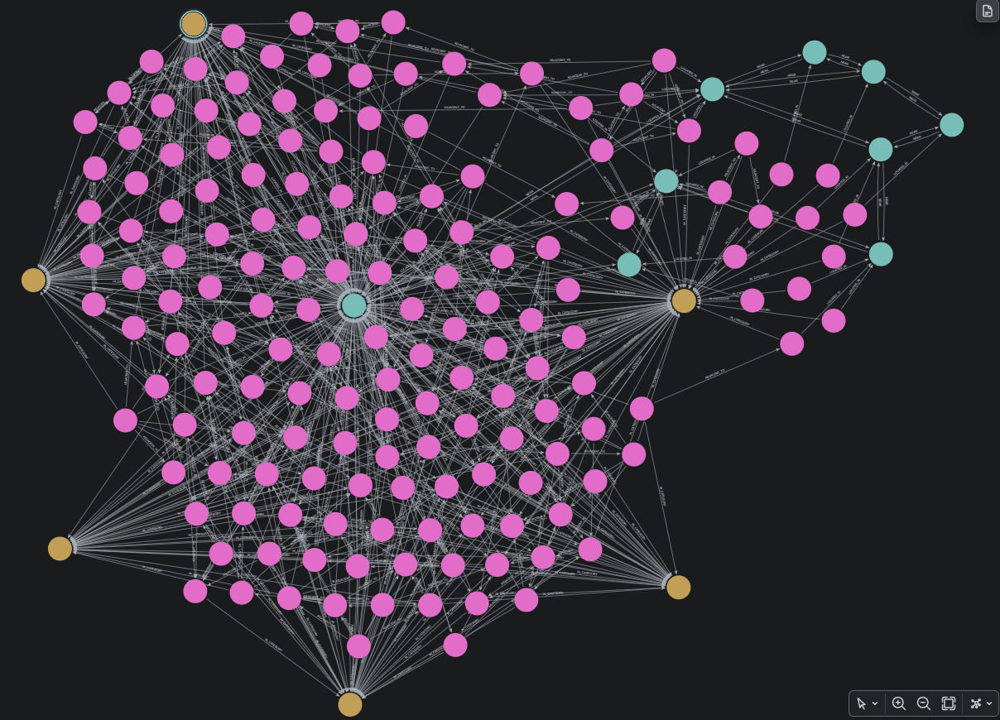
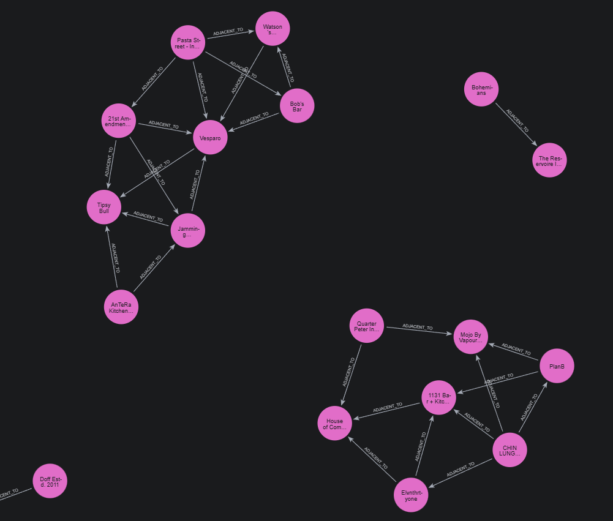
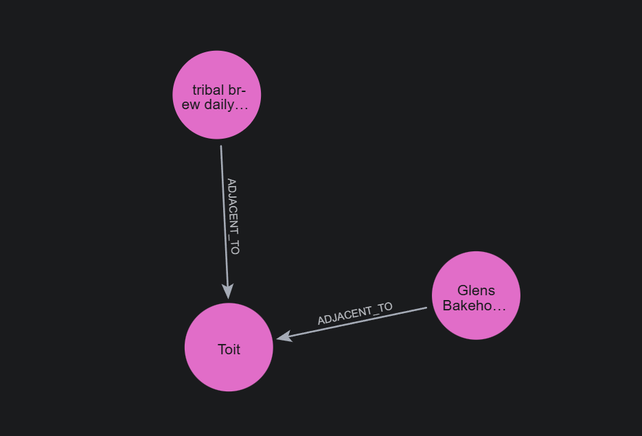
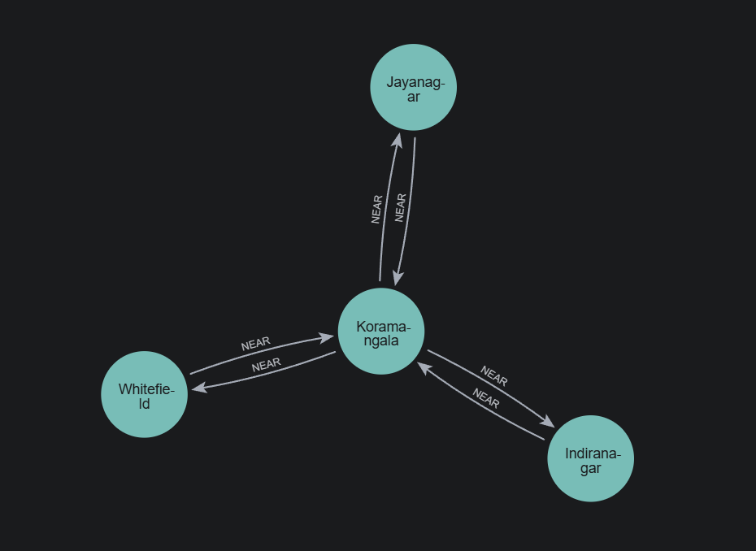
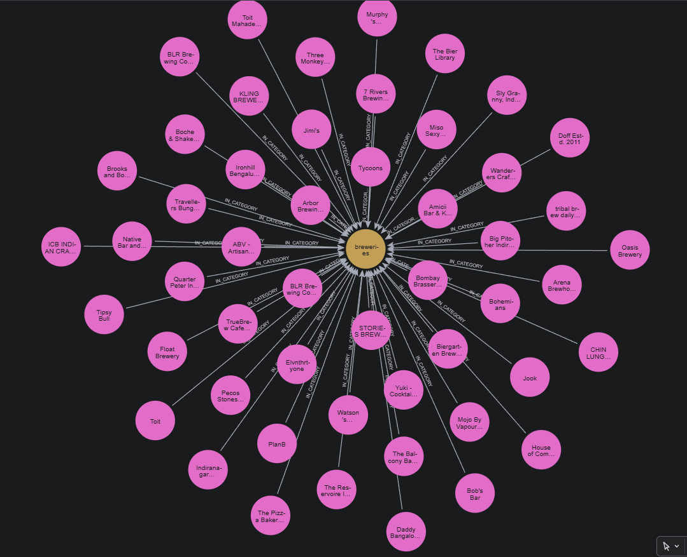
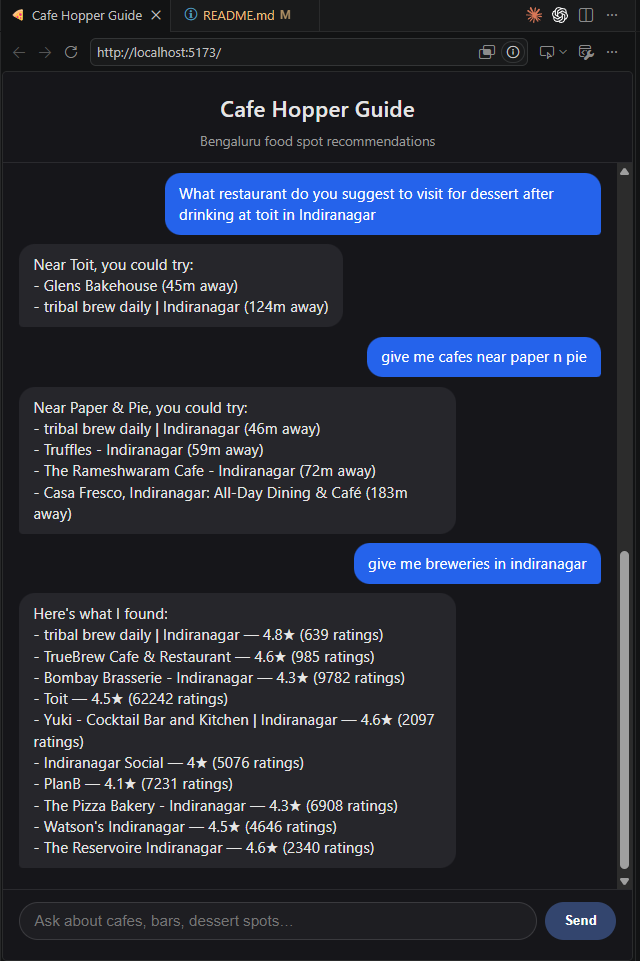

# Cafe Hopper Guide

**Try it live: [blr-restaurant-rec-git-29dad1-samarthdsankhla16-1629s-projects.vercel.app](https://blr-restaurant-rec-git-29dad1-samarthdsankhla16-1629s-projects.vercel.app/)**
(backend is on Railway's free tier and Neo4j Aura auto-pauses after inactivity — if the first response
is slow or says the graph is down, that's a cold start/resume, not a crash; try again in a moment)

A Bengaluru food-spot recommender built on a knowledge graph, not a search index — ask a plain-English
question, an LLM parses it into structured intent, and that intent drives a real graph traversal in
Neo4j (proximity, category, area adjacency, specialty) instead of a keyword filter.

> Working title — naming still TBD.

## Screenshots

<!-- Drop screenshots here, e.g.: -->
<!--  -->
<!--  -->

## Sample queries

Run these directly in Neo4j Browser / Aura's Query tab. Most mirror a natural-language question the
chat pipeline actually handles — this is the real Cypher `intent_to_cypher()` would generate for that
question, not a hand-picked demo query — scoped small (one area/category at a time) so the graph view
stays readable. The one exception is #1: a capped whole-graph view, since an *uncapped*
`MATCH (n) RETURN n` on the full dataset is a mess (Indiranagar alone has 150+ places) — `LIMIT 150`
keeps it renderable while still showing every node/edge type at once. Full list in
[`backend/sample_queries_to_test/cypher_queries.md`](backend/sample_queries_to_test/cypher_queries.md).

**1. Full graph snapshot** — every node/edge type at once, capped so it stays renderable
```cypher
MATCH (n)-[r]-(m)
RETURN n, r, m
```


**2. "What bars in Indiranagar are near each other?"**
```cypher
MATCH (p1:Place)-[:LOCATED_IN]->(:Area {name: "Indiranagar"}),
      (p1)-[:IN_CATEGORY]->(:Category {name: "bars"}),
      (p1)-[r:ADJACENT_TO]-(p2:Place)-[:IN_CATEGORY]->(:Category {name: "bars"})
RETURN p1, r, p2
```


**3. "What's a good dessert spot near Toit?"** — fuzzy name resolution + proximity traversal
```cypher
CALL db.index.fulltext.queryNodes('place_name_fulltext', 'toit~1') YIELD node AS ref, score
WITH ref, score ORDER BY score DESC LIMIT 1
MATCH (ref)-[r:ADJACENT_TO]-(p:Place)-[:IN_CATEGORY]->(:Category {name: "dessert shops"})
RETURN ref, r, p
```


**4. "Which areas are near Koramangala?"** — pure area-to-area, naturally small and clean
```cypher
MATCH (a:Area {name: "Koramangala"})-[r:NEAR]-(other:Area)
RETURN a, r, other
```


**5. "Show me breweries"** — one category, decluttered by design
```cypher
MATCH (c:Category {name: "breweries"})<-[r:IN_CATEGORY]-(p:Place)
RETURN c, r, p
```
<!--  -->

**6. "Where can I get good filter coffee in Basavanagudi?"** — `Specialty`/`FAMOUS_FOR`, extracted
directly from review text, not the mechanical `Category`
```cypher
MATCH (p:Place)-[:LOCATED_IN]->(:Area {name: "Basavanagudi"}),
      (p)-[r:FAMOUS_FOR]->(s:Specialty {name: "Filter Coffee"})
RETURN p, r, s
```

## Example

> "What restaurant do you suggest to visit for dessert after drinking at toit in Indiranagar?"



The question resolves a typo'd place name ("toit" → "Toit") via fuzzy full-text search, traverses
real walking-distance proximity edges from there, filters to dessert spots, and returns a ranked
answer — not a list of places that merely mention "dessert" in a review.

## How it works

```
NL question
   │
[Intent parsing]   LLM extracts structured intent (category, area, specialty, reference place,
   │                relationship type, sort) -- schema fed in live from Neo4j itself, not a
   │                hand-maintained description. Off-topic questions (code, general knowledge,
   │                anything not about Bengaluru food spots) are refused here, before any
   │                Cypher runs.
   │
[Cypher templating]  deterministic Python -- Cypher is never freely generated by an LLM
   │                  against the live database
   │
[Neo4j]  graph traversal -- LOCATED_IN / IN_CATEGORY / FAMOUS_FOR / NEAR (areas) / ADJACENT_TO (places)
   │
[Answer formatting]  deterministic templating -- fast, can't hallucinate. Empty near-a-place
   │                  results get one relaxed retry (drop tier/category/specialty filters)
   │                  before falling back to an honest "no data" message.
Chat response  +  a small subgraph snippet of the nodes/edges that actually produced it,
                   rendered client-side on request (no extra LLM/DB call)
```

Full architecture notes, every design decision, and the "why" behind each one live in
[`blr-food-recommender-context.md`](blr-food-recommender-context.md) — the project's working doc.

## Currently working

- Knowledge graph in Neo4j covering **360 places across 33 Bengaluru neighborhoods**: `Place` /
  `Area` / `Category` / `Specialty` nodes, real relationships (not just attribute filters) —
  `LOCATED_IN`, `IN_CATEGORY`, `FAMOUS_FOR`, `NEAR` (area-to-area adjacency), `ADJACENT_TO` (real
  walking-distance proximity between places, not just same-neighborhood)
- `Specialty`/`FAMOUS_FOR` (e.g. "Filter Coffee", "Craft Beer", "Biryani") and a per-place
  `things_to_try` property (exact menu items, e.g. "nutella creme caramel coffee") — extracted
  directly from review text against a closed, bottom-up-discovered vocabulary (18 specialties),
  not scraped/mechanical like `Category`
- Fuzzy place-name resolution (typo-tolerant, Lucene full-text index)
- Two-stage NL → intent → Cypher query pipeline, with a small golden-set eval for intent-parsing
  accuracy, and an explicit scope guardrail (off-topic requests — code, general knowledge, etc. —
  are refused before any Cypher runs, not answered as a general-purpose assistant)
- Verified follow-up suggestions: every clickable suggestion chip is built as a real structured
  query and probed against the graph before ever being shown, so a suggestion can't dead-end into
  "nothing found." Conversation memory (which places/questions have already come up) steers repeat
  "what's near X" chains toward new territory instead of bouncing between the same tight cluster.
- Rate limiting (10 requests / 10s per client) so a burst can't drain LLM tokens
- Structured chat UI: place/place-pair/area result cards (gold-starred ratings, pill-styled
  "Try" items) instead of parsed plain text, copy-to-clipboard on any answer, and an on-demand
  "View knowledge graph" button that renders a small static node-link diagram of the actual
  subgraph behind that answer (click to zoom, no extra LLM/DB call)
- FastAPI backend + React/Vite chat frontend, wired end to end
- Docker + Railway (backend) / Vercel (frontend) deployment scaffolding
- Graceful handling when Neo4j Aura is paused (free-tier auto-pause after inactivity): a fast
  connection timeout instead of a long hang, a clear in-chat message instead of a generic error, and
  a cooldown-limited email alert to the owner so the instance can be resumed

## Planned / not yet built

- `Vibe` and `Diet` nodes (e.g. "quiet, good for laptop work", "suitable for vegans") — `Specialty`
  is done, these two locked schema pieces aren't yet
- Semantic retrieval layer (pgvector) fused with the graph — current system is graph-only
- Accessibility/reachability scoring (Directions API)
- Full evaluation harness (RAGAS) beyond the current intent-accuracy eval
- LLM-based answer synthesis (current answers are templated, not generated)
- Full-city dataset — 360 places across 33 areas today, still a subset of Bengaluru's actual density

## Tech stack

Python · FastAPI · Neo4j (Aura) · OpenAI (`gpt-4o-mini`) · Google Places API · React + Vite +
TypeScript · Docker · Railway · Vercel

## Project structure

```
backend/
  app/          reusable modules the running API imports (intent parsing, Cypher templating, schema introspection)
  scripts/      one-off ingestion/graph-build/eval scripts, run directly
  main.py       FastAPI entrypoint
frontend/       React + Vite + TypeScript chat UI
```

## Running locally

**Backend** (needs a `.env` in `backend/` with `NEO4J_URI`, `NEO4J_USERNAME`, `NEO4J_PASSWORD`,
`OPENAI_API_KEY`, `GCP_PLACES_API`, `MIN_RATING_COUNT` — plus optional `ALERT_EMAIL_FROM`,
`ALERT_EMAIL_APP_PASSWORD`, `ALERT_EMAIL_TO` for the Neo4j-down email alert, silently skipped if unset):
```
cd backend
uv sync
uv run uvicorn main:app --reload
```

**Frontend** (needs a `.env.local` in `frontend/` with `VITE_API_BASE_URL`, see `.env.example`):
```
cd frontend
npm install
npm run dev
```
